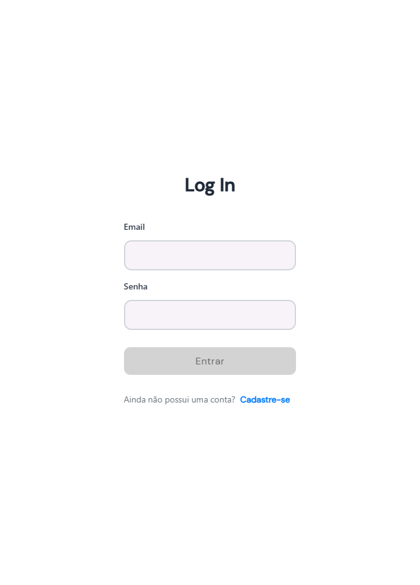
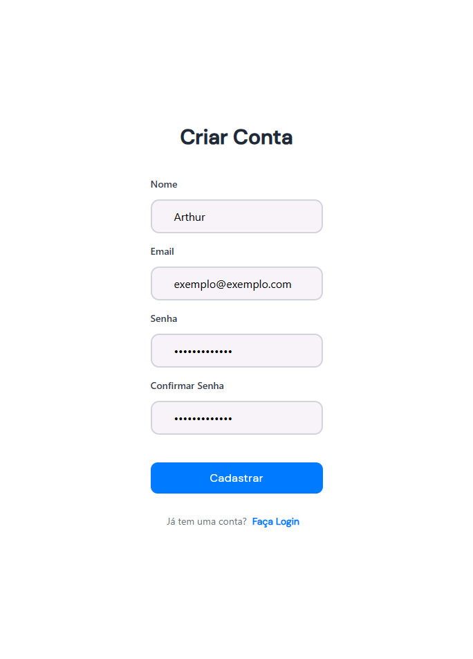
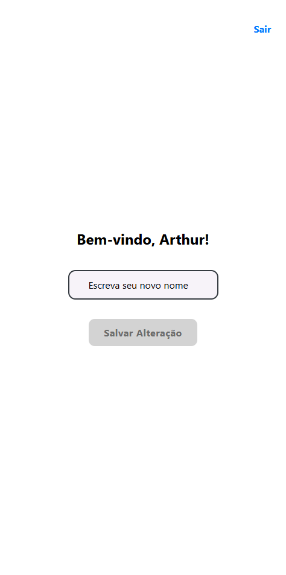
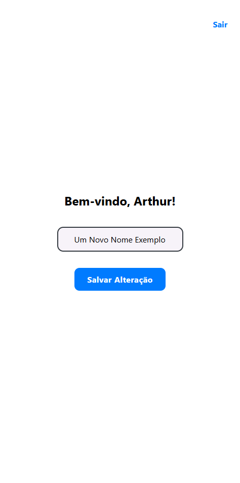
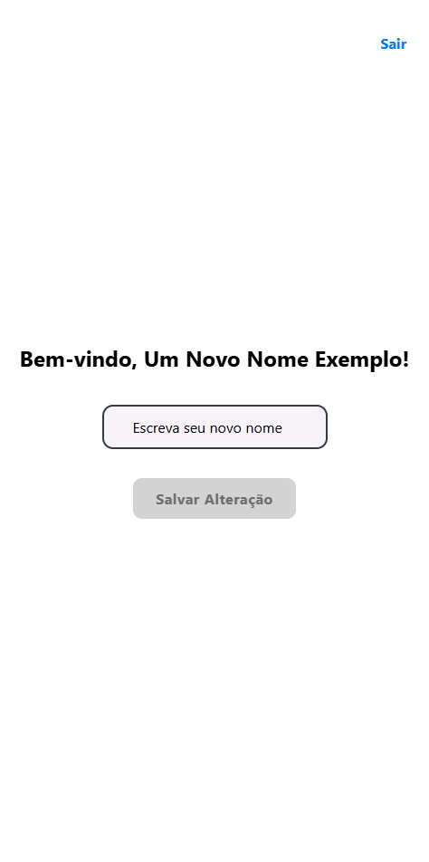

<h1 align="center">Case BairruDev Frontend</h1>
<p align="center">
  
  <br>
  <i>
  This application is the Frontend portion of the BairruDev entry test App, built with
  <br>React Native (Expo).
  </i>
  <br>
</p>

## Introduction

This guide provides instructions for setting up and running the frontend of the BairruDev entry test case. This frontend was created with React Native, and was written using Typescript. This frontend is meant to be used with the backend seen in the [caseBairruDevBack](https://github.com/nothingnothings/caseBairruDevBack) repository.












## Technologies 
 
 Some of the Languages, Packages and Libraries employed on this frontend:

  - Node Package Manager (for bootstrapping and managing the Node backend app)
  - TypeScript
  - React Native – The core framework for building cross-platform mobile apps.
  - Expo – Framework and platform for universal React applications, simplifying development and deployment.
  - Secure Store – Ensures sensitive information is securely stored on the device.
  - Axios – Handles API requests to the backend
  - Tailwind CSS (via `twrnc`) – Enables utility-first styling for a responsive UI.
  - `react-native-reanimated` – Provides smooth animations


## Project Directory Structure

The frontend project's directory structure:


```
|   .env
|   .env.example
+---.expo
|   .gitignore
|   app.json
|   BairruDev.postman_collection
|   declarations.d.ts
|   expo-env.d.ts
+---node_modules
|   package-lock.json
|   package.json
|   react-native.config.ts
|   README.md
|   tailwind.config.js
|   tsconfig.json
|
+---app
|   |   +not-found.tsx
|   |   login.tsx
|   |   register.tsx
|   |   _layout.tsx
|   |
|   \---(app)
|           index.tsx
|           _layout.tsx
|
+---assets
|   +---fonts
|   |       DMSans-Bold.ttf
|   |       DMSans-Medium.ttf
|   |       DMSans-Regular.ttf
|   |
|   \---images
|           favicon.png
|
+---components
|   +---common
|   |   +---alert
|   |   |       alert.style.ts
|   |   |       Alert.tsx
|   |   |
|   |   +---title
|   |   |       Title.tsx
|   |   |
|   |   \---wrappers
|   |       \---layout
|   |           |   Layout.tsx
|   |           |
|   |           \---animationWrapper
|   |               |   AnimationWrapper.tsx
|   |               |
|   |               \---safeAreaViewAndroid
|   |                       SafeAreaViewAndroid.tsx
|   |
|   +---form
|   |   |   Form.tsx
|   |   |
|   |   +---formButton
|   |   |       FormButton.tsx
|   |   |
|   |   +---formInput
|   |   |       FormInput.tsx
|   |   |
|   |   +---formLabel
|   |   |       FormLabel.tsx
|   |   |
|   |   \---linkButton
|   |           LinkButton.tsx
|   |
|   \---__tests__
|       |   ThemedText-test.tsx
|       |
|       \---__snapshots__
|               ThemedText-test.tsx.snap
|
+---constants
|       index.ts
|       theme.ts
|
+---context
|       ctx.tsx
|       useStorageState.ts
|
+---scripts
|       reset-project.js
|
+---types
|   \---auth
|           login.ts
|           register.ts
|           user.ts
|
\---utils
        auth.ts
```

## Project Configuration Files (package.json)

The package.json file used in the project:


```
{
  "name": "my_project",
  "main": "expo-router/entry",
  "version": "1.0.0",
  "scripts": {
    "start": "npx expo start --dev-client --clear",
    "reset-project": "node ./scripts/reset-project.js",
    "android": "expo start --android",
    "ios": "expo start --ios",
    "web": "expo start --web",
    "test": "jest --watchAll",
    "lint": "expo lint",
    "postinstall": "patch-package"
  },
  "jest": {
    "preset": "jest-expo"
  },
  "dependencies": {
    "@react-native-async-storage/async-storage": "^1.23.1",
    "@react-navigation/bottom-tabs": "^7.2.0",
    "@react-navigation/native": "^7.0.14",
    "@react-navigation/stack": "^7.1.1",
    "axios": "^1.8.4",
    "deprecated-react-native-prop-types": "^2.2.0",
    "expo": "~52.0.38",
    "expo-auth-session": "~6.0.3",
    "expo-blur": "~14.0.3",
    "expo-constants": "~17.0.3",
    "expo-crypto": "~14.0.2",
    "expo-device": "~7.0.1",
    "expo-font": "~13.0.2",
    "expo-haptics": "~14.0.0",
    "expo-linking": "~7.0.5",
    "expo-navigation-bar": "~4.0.8",
    "expo-router": "~4.0.19",
    "expo-secure-store": "~14.0.1",
    "expo-splash-screen": "~0.29.22",
    "expo-status-bar": "~2.0.0",
    "expo-symbols": "~0.2.2",
    "expo-system-ui": "~4.0.8",
    "expo-web-browser": "~14.0.1",
    "patch-package": "^8.0.0",
    "postinstall-postinstall": "^2.1.0",
    "react": "18.3.1",
    "react-dom": "18.3.1",
    "react-native": "0.76.7",
    "react-native-animatable": "^1.4.0",
    "react-native-awesome-alerts": "^2.0.0",
    "react-native-gesture-handler": "~2.20.2",
    "react-native-paper": "^5.13.1",
    "react-native-reanimated": "~3.16.1",
    "react-native-safe-area-context": "4.12.0",
    "react-native-screens": "~4.4.0",
    "react-native-svg": "^15.8.0",
    "react-native-web": "~0.19.13",
    "react-native-webview": "13.12.5",
    "tailwindcss": "^3.4.17",
    "twrnc": "^4.6.0"
  },
  "devDependencies": {
    "@babel/core": "^7.25.2",
    "@react-native-community/cli": "^15.1.3",
    "@types/jest": "^29.5.12",
    "@types/react": "~18.3.12",
    "@types/react-test-renderer": "^18.3.0",
    "jest": "^29.2.1",
    "jest-expo": "~52.0.6",
    "react-native-dotenv": "^3.4.11",
    "react-test-renderer": "18.3.1",
    "typescript": "^5.3.3"
  },
  "private": true
}
```

## Setup 


To use this project, follow these steps:

1. Clone the Repository: Run `git clone` to clone the project into your local Git repository
2. Configure the Environment Variables: Create a `.env` file at the root of the project and add the following values, as seen in the `.env.example` file:

```
EXPO_PUBLIC_APP_URL="http://localhost:8081"
EXPO_PUBLIC_BACKEND_API="http://localhost:3000"
```
3. Install `npm` Dependencies: Run `npm install`
4. Start the frontend app: Run `npm start`
5. Pair the running frontend app with the backend seen in the [caseBairruDevBack Repo](https://github.com/nothingnothings/caseBairruDevBack)

Optionally, if you want to test the project in mobile devices, locally:

6. Get the IP address of the device running the backend: Run `ipconfig` (windows), then write down the IPv4 address of the machine.
7. Set device's local IP address as the value of the `EXPO_PUBLIC_BACKEND_API` variable in the `.env` file: the line will look like `EXPO_PUBLIC_BACKEND_API="http://192.168.0.137:3001"`.
8. Restart the app, with `npm start`.

## Endpoints:

| Method  | Endpoint              | Description                                  | Authentication Required |
|---------|-----------------------|----------------------------------------------|-------------------------|
| `POST`  | `/auth/register`      | Registers a new user                        | ❌ No                   |
| `POST`  | `/auth/login`         | Authenticates user and returns a JWT        | ❌ No                   |
| `DELETE`| `/auth/delete`        | Deletes the authenticated user              | ✅ Yes                  |
| `GET`   | `/auth/user/:userId`  | Retrieves the name of a specific user       | ✅ Yes                  |
| `PUT`   | `/auth/alterName`     | Updates the authenticated user's name       | ✅ Yes                  |
| `GET`   | `/auth/validate`      | Validates if a user is authenticated        | ✅ Yes                  |


## Features

- **User Authentication, using JWT** - Secure login and session management.
- **Navigation and Routing, with Expo**
- **TailwindCSS** - for minor styling and prototyping.
- **React Native Reanimated** - for smooth transition animations.
- **Backend Node API Integration** - The app communicates with the Fastify backend using `axios` to send and receive data, including user authentication and user data (the user's name property).
- **Protected Routes**: Routes not related to registration/login actions are protected by middleware that checks if the user is authenticated before granting access.
- **Environment Variable Configuration** - Secure secrets management using `.env` files.

## Additional Notes

- **Ensure Docker is installed and running** before attempting to start the database.
- **Environment variables must be configured correctly** for the application to function properly.
- **If you wish to test the backend without using the frontend, you can import the included `BairruDev.postman_collection` into Postman**; you only need to fire the "Register" route, copy the `token` property and then include it in the "Authorization" header of the other requests, as a "Bearer <token>" value.
